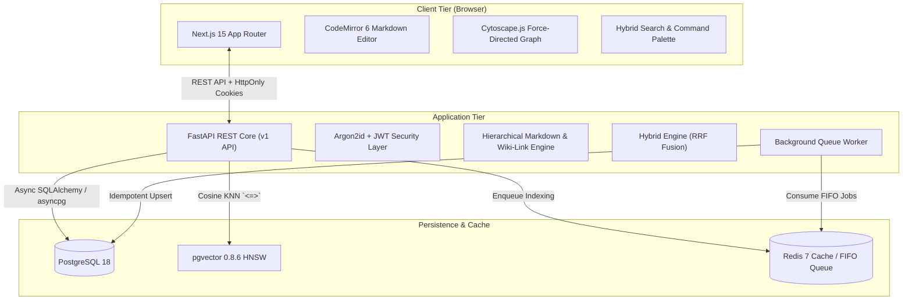
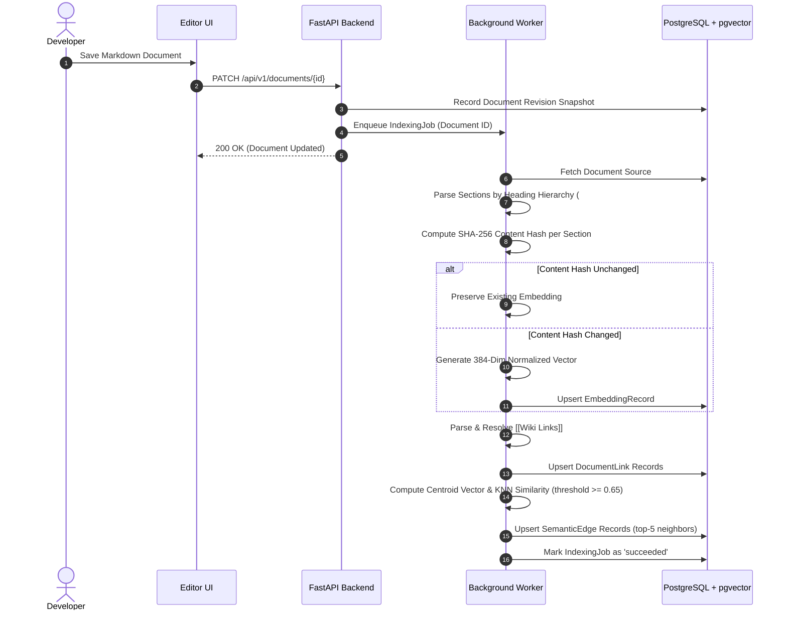
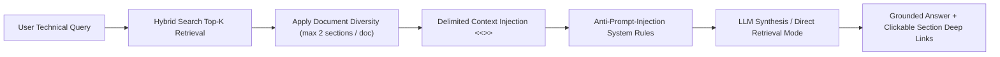

# NexusDocs: Technical Architecture & System Design

NexusDocs is an open-source, production-grade technical knowledge platform designed for high developer productivity, zero-hallucination AI exploration, and graph-connected documentation.

---

## 1. System Components Topology

---

## 2. Ingestion & Indexing Pipeline

---

## 3. Hybrid Search Architecture & Reciprocal Rank Fusion

### Why Hybrid Search Over Vector-Only Search?
1. **Keyword Blind Spots**: Dense vector embeddings often struggle with exact software identifiers (e.g., `pg_stat_activity`, `CVE-2025-66478`, `UUIDv4`).
2. **Semantic Blind Spots**: Traditional keyword searches fail when developers query concepts with different vocabulary (e.g., "how do we prevent outages" vs. "incident runbook procedures").
3. **The Reciprocal Rank Fusion (RRF) Solution**:
   Rank lists from both models are merged without requiring calibrated cross-model raw scores:
   $$RRF(d) = \sum_{m \in \{\text{keyword}, \text{semantic}\}} \frac{w_m}{60 + r_m(d)}$$
   - Parameter $k = 60$ prevents top outliers from overwhelmingly skewing overall relevance.
   - Deterministic, robust, and easily verified with automated integration tests.

---

## 4. Citation-First RAG Pipeline

### Prompt-Injection Mitigation
Indexed technical documentation is treated as untrusted data:
1. Every section is encapsulated in explicit boundary tokens: `<<<CONTEXT_SECTION id="..." title="..." path="...">>>`.
2. System instructions strictly declare that context data cannot grant administrator privileges, reveal secrets, or instruct the assistant to disregard developer guidelines.
3. If no LLM key is configured, NexusDocs degrades gracefully: displaying top retrieved matching excerpts and a one-click transition to hybrid search results.

---

## 5. Scaling Considerations

- **Horizontal API Scaling**: The FastAPI backend is stateless, relying on JWT credentials or secure cookies and PostgreSQL/Redis for state.
- **HNSW Vector Indexing**: `embedding vector_cosine_ops` using Hierarchical Navigable Small World graphs scales sub-linearly with logarithmic query latency ($O(\log N)$).
- **Partitioning & Sharding**: Workspaces provide a clean partitioning key (`workspace_id`), allowing horizontal multi-tenant database sharding when scaling to hundreds of thousands of engineering organizations.
