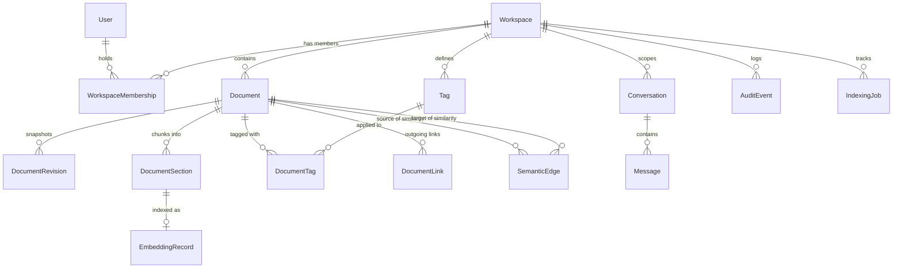

# NexusDocs: Data Model & Persistence Architecture

NexusDocs uses PostgreSQL with the `pgvector` extension for transactional relational records, full-text inverted indexes, and dense vector similarity retrieval.

---

## 1. Entity-Relationship Diagram (ERD)

---

## 2. Table Specifications & Index Design

### `users`
- **Purpose**: Authenticated system users and credentials.
- **Columns**:
  - `id` (UUID, PK)
  - `email` (VARCHAR(255), UNIQUE, INDEX)
  - `display_name` (VARCHAR(255))
  - `password_hash` (VARCHAR(255), Argon2id)
  - `status` (VARCHAR(50), default `'active'`)
  - `created_at` / `updated_at` (TIMESTAMPTZ)

### `workspaces`
- **Purpose**: Organizational boundary and multi-tenant tenant isolation container.
- **Columns**:
  - `id` (UUID, PK)
  - `name` (VARCHAR(255))
  - `slug` (VARCHAR(255), UNIQUE, INDEX)
  - `description` (TEXT, nullable)
  - `created_by` (UUID, FK -> `users.id`)
  - `created_at` / `updated_at` (TIMESTAMPTZ)

### `workspace_memberships`
- **Purpose**: Role-based access control binding users to workspaces.
- **Columns**:
  - `id` (UUID, PK)
  - `workspace_id` (UUID, FK -> `workspaces.id` ON DELETE CASCADE)
  - `user_id` (UUID, FK -> `users.id` ON DELETE CASCADE)
  - `role` (VARCHAR(50)): `'owner'`, `'editor'`, or `'viewer'`
  - `joined_at` (TIMESTAMPTZ)
- **Constraints & Indexes**:
  - `UNIQUE (workspace_id, user_id)`
  - Index on `(user_id, role)`

### `documents`
- **Purpose**: Primary documentation entity storing raw Markdown source.
- **Columns**:
  - `id` (UUID, PK)
  - `workspace_id` (UUID, FK -> `workspaces.id` ON DELETE CASCADE)
  - `title` (VARCHAR(500))
  - `slug` (VARCHAR(500))
  - `markdown` (TEXT)
  - `plain_text` (TEXT)
  - `status` (VARCHAR(50), default `'published'`)
  - `version_number` (INT, default 1)
  - `created_by` / `updated_by` (UUID, FK -> `users.id`)
  - `created_at` / `updated_at` (TIMESTAMPTZ, INDEX)
  - `deleted_at` (TIMESTAMPTZ, nullable, INDEX)
- **Indexes**:
  - Composite `(workspace_id, slug)`
  - Composite `(workspace_id, deleted_at)`
  - GIN Index: `to_tsvector('english', title || ' ' || plain_text)`

### `document_revisions`
- **Purpose**: Immutable snapshot history for auditing and instant rollback.
- **Columns**:
  - `id` (UUID, PK)
  - `document_id` (UUID, FK -> `documents.id` ON DELETE CASCADE)
  - `title` (VARCHAR(500))
  - `markdown` (TEXT)
  - `version_number` (INT)
  - `created_by` (UUID)
  - `created_at` (TIMESTAMPTZ)
- **Indexes**:
  - `(document_id, version_number)`

### `document_sections`
- **Purpose**: Semantic units chunked by heading hierarchy (`#`, `##`, `###`).
- **Columns**:
  - `id` (UUID, PK)
  - `document_id` (UUID, FK -> `documents.id` ON DELETE CASCADE)
  - `heading_path` (VARCHAR(1000)): e.g. `System Architecture > Topology > Core API`
  - `heading_level` (INT)
  - `ordinal` (INT)
  - `content_text` (TEXT)
  - `token_count` (INT)
  - `content_hash` (VARCHAR(64), SHA-256 of content)
  - `created_at` (TIMESTAMPTZ)
- **Indexes**:
  - GIN Index: `to_tsvector('english', heading_path || ' ' || content_text)`
  - `(document_id, ordinal)`
  - `content_hash`

### `embedding_records`
- **Purpose**: Dense vector embeddings stored with pgvector.
- **Columns**:
  - `id` (UUID, PK)
  - `section_id` (UUID, FK -> `document_sections.id` ON DELETE CASCADE, UNIQUE)
  - `embedding` (VECTOR(384))
  - `model_identifier` (VARCHAR(100))
  - `dimensionality` (INT, 384)
  - `content_hash` (VARCHAR(64))
  - `indexed_at` (TIMESTAMPTZ)
- **Indexes**:
  - HNSW Index: `embedding vector_cosine_ops`

### `document_links`
- **Purpose**: Explicit relationships extracted from wiki-links `[[Target Title]]` and `[[Target Title#Heading]]`.
- **Columns**:
  - `id` (UUID, PK)
  - `workspace_id` (UUID, FK)
  - `source_document_id` (UUID, FK -> `documents.id` ON DELETE CASCADE)
  - `target_document_id` (UUID, FK -> `documents.id` ON DELETE SET NULL, nullable)
  - `raw_target_title` (VARCHAR(500))
  - `target_heading` (VARCHAR(500), nullable)
  - `created_at` (TIMESTAMPTZ)

### `semantic_edges`
- **Purpose**: AI-discovered relationships between documents based on vector cosine similarity.
- **Columns**:
  - `id` (UUID, PK)
  - `workspace_id` (UUID, FK)
  - `source_document_id` (UUID, FK)
  - `target_document_id` (UUID, FK)
  - `score` (FLOAT, cosine similarity $\ge 0.65$)
  - `relation_type` (VARCHAR(50), default `'semantic_similarity'`)
  - `matched_sections` (TEXT, JSON string explaining match)
  - `generated_at` (TIMESTAMPTZ)
- **Indexes**:
  - `UNIQUE (source_document_id, target_document_id, relation_type)`
  - Index on `score`
