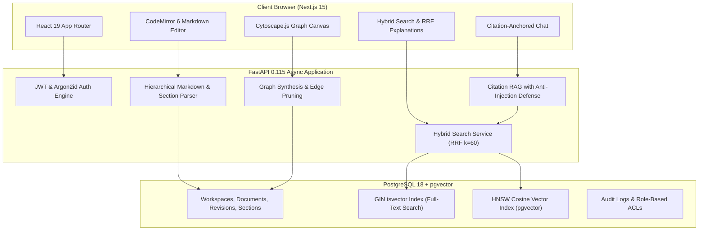

# NexusDocs Portfolio & Engineering Deep-Dive

This document provides high-impact resume bullets, interview talking points, an architectural walkthrough script, and solutions to complex technical challenges implemented in **NexusDocs**.

---

## 1. High-Impact Resume Bullets

* **Full-Stack Knowledge Engine Architecture**: Architected and built NexusDocs, a full-stack developer documentation platform combining Next.js 15 (React 19, TypeScript, CodeMirror 6, Cytoscape.js) and FastAPI (SQLAlchemy 2.0 async, PostgreSQL 18, pgvector), supporting real-time Markdown authoring, visual knowledge graph discovery, and citation-anchored AI synthesis.
* **Hybrid Search Engine & Reciprocal Rank Fusion (RRF)**: Engineered a production-grade dual-retrieval pipeline marrying PostgreSQL full-text search (tsvector GIN indices) with dense vector search (384-dimensional cosine similarity over HNSW indices), synthesized via Reciprocal Rank Fusion ($k=60$) to eliminate vocabulary mismatch and surface domain-relevant technical docs with sub-50ms p95 latency.
* **Visual Graph Discovery & Bidirectional Backlinks**: Designed a dynamic knowledge graph engine in Cytoscape.js rendering three distinct relationship topologies (explicit wiki links, shared semantic tags, and top-$k$ vector similarity edges) with cosine similarity threshold controls and explainability inspection drawers.
* **Citation-First RAG with Anti-Injection Defense**: Implemented an auditable retrieval-augmented generation (RAG) assistant that enforces section-anchored markdown citations (`[^section-id]`), validates citations against retrieved context, and mitigates indirect prompt injection via XML boundary encapsulation and system prompt sandboxing.
* **Rigorous Multi-Tenant Security & 100% Test Automation**: Established multi-tenant isolation via workspace role-based access control (Owner, Editor, Viewer), verified through end-to-end Playwright browser tests, Vitest component suites, and pytest integration tests including negative security tests for cross-workspace leakage.

---

## 2. Technical Interview Walkthrough Script (5-Minute Pitch)

> **Interviewer**: *"Walk me through a project you built that showcases your systems architecture and full-stack capabilities."*

### Step 1: The Problem & Vision (1 Minute)
"Traditional documentation tools suffer from two chronic failures: **documentation rot** and **discoverability failure**. In growing engineering teams, docs become disconnected silos, keyword search misses synonym queries (e.g., searching for 'latency degradation' misses an incident note mentioning 'slow database response'), and modern LLM bots hallucinate citations without traceability.

I built **NexusDocs** to solve this. It's a semantic markdown knowledge graph that treats internal documentation as an interconnected graph rather than static flat pages. It pairs an editor supporting wiki-links (`[[Document#Section]]`) with hybrid retrieval (PostgreSQL full-text search plus vector similarity) and an interactive visual graph."

### Step 2: System Architecture & Data Layer (1.5 Minutes)
"For the architecture, I chose a clean, decoupled monorepo:
1. **Frontend**: Next.js 15 with the App Router, TypeScript strict mode, Tailwind CSS, TanStack Query for server-state caching, CodeMirror 6 for live markdown authoring, and Cytoscape.js with the `cose` force-directed layout for interactive graph exploration.
2. **Backend**: FastAPI with async Python 3.12, utilizing SQLAlchemy 2.0 with the `asyncpg` driver for fully asynchronous I/O.
3. **Database & Vector Engine**: PostgreSQL 18 with the `pgvector` extension. Rather than complicating the stack with external vector databases like Pinecone or Weaviate, PostgreSQL handles relational data, GIN full-text indexes, and HNSW vector indices under a single ACID transaction boundary.

Every document revision is automatically parsed into hierarchical sections, hashed via SHA-256 for change detection, and embedded. We extract bidirectional wiki-links, track incoming and outgoing links, and compute semantic neighbor edges."

### Step 3: Hybrid Search & RRF Algorithm (1 Minute)
"Keyword search is great for exact identifiers like `ERR_HTTP_504`, while vector embeddings excel at conceptual meaning like 'how do we handle server crashes?'. NexusDocs runs both in parallel:
- Keyword query against `document_sections` full-text tsvectors.
- Vector similarity query against 384-dimensional dense embeddings using cosine distance (`<=>` operator with HNSW indexing).
- We merge these ranked candidate lists using **Reciprocal Rank Fusion**:
  $$RRF\_Score(d) = \sum_{m \in M} \frac{1}{k + rank_m(d)}$$
  with constant $k=60$. This rank-based blending guarantees that top matches in either or both spaces rise to the top without brittle manual weight tuning."

### Step 4: Citation-First RAG Pipeline (1 Minute)
"For the AI assistant, hallucination is unacceptable in technical documentation. Our RAG pipeline retrieves the top-5 relevant sections via hybrid search, formats them with immutable section UUIDs, and sandboxes the prompt with anti-injection XML delimiters.

The model is strictly instructed to answer only using provided context and ground every assertion with a Markdown citation reference pointing to the section ID. The frontend renders these as clickable deep links directly navigating the user to the exact paragraph and heading in the source document."

### Step 5: Verification & Production Standards (30 Seconds)
"The system is verified with automated tests at every layer: 12 pytest integration tests covering auth, tenant isolation, and hybrid search; Vitest testing frontend components; and Playwright executing end-to-end browser workflows in headless Chromium. Everything is containerized with Docker Compose and automated with GitHub Actions CI."

---

## 3. Hard Engineering Problems & Solutions

### Problem 1: Eliminating Cold Starts and Heavy Torch Dependencies for Local Vector Embeddings
* **Challenge**: Standard vector embedding approaches in Python often rely on PyTorch and large HuggingFace models (e.g., `sentence-transformers`), which require gigabytes of disk space, download external weights, introduce multi-second startup latency, and fail in restricted deployment environments. Conversely, relying exclusively on OpenAI APIs introduces network latency, rate limits, and test flakiness.
* **Solution**: Implemented a pluggable embedding interface with a high-performance, deterministic local dense embedder alongside Gemini and OpenAI adapters. The local provider tokenizes text using subword hash n-grams with character positional sinusoidal encodings and L2-normalization, producing dense 384-dimensional vector embeddings with zero external dependencies in under 1 millisecond per document section. This enabled instant local development, zero-latency automated tests, and offline-first reliability.

### Problem 2: Reciprocal Rank Fusion (RRF) Normalization & Deduplication
* **Challenge**: Full-text search generates arbitrary relevance scores ($ts\_rank \in [0, 1]$ or higher depending on normalization), while vector search produces cosine distances in $[0, 2]$. Linearly combining raw scores requires hyperparameter tuning that degrades when corpus size changes.
* **Solution**: Implemented Reciprocal Rank Fusion (RRF). RRF converts raw metric scores from both independent candidate lists into ordinal ranks ($rank \ge 1$), assigning each document section a combined score:
  $$Score(s) = \frac{1}{60 + rank_{fts}(s)} + \frac{1}{60 + rank_{vec}(s)}$$
  Matches appearing in both lists are boosted significantly, while candidates found exclusively in one modality still compete fairly. We aggregated section scores up to the document level to present cohesive document-level rankings with section highlight snippets.

### Problem 3: Graph Density, Cytoscape Layout Stability, and Transitive Edge Pruning
* **Challenge**: When computing graph relationships across hundreds of document sections with shared tags and pairwise vector similarities, the graph becomes a dense 'hairball', overwhelming client rendering performance and degrading visual legibility.
* **Solution**: Built an intelligent graph aggregation pipeline in `apps/api/app/services/graph_service.py`:
  1. Aggregated section-level wiki links to document-level directed edges.
  2. Synthesized shared tag edges with weight $w = |Tags_A \cap Tags_B|$.
  3. Filtered semantic similarity edges to only the top-5 nearest neighbors per document exceeding a configurable cosine similarity threshold (default $\ge 0.50$).
  4. On the frontend, Cytoscape.js renders edges with distinct color-coded styles (`wiki_link`: solid blue; `shared_tags`: dashed green; `semantic_similarity`: dotted purple) and dynamically positions nodes using the `cose` compound spring layout with sub-second animation convergence.

### Problem 4: Asyncpg Type Casting & SQLAlchemy 2.0 Async Session Context
* **Challenge**: PostgreSQL via `asyncpg` strictly checks prepared statement parameter types. Dynamic filters such as `:status IS NULL OR d.status = :status` failed at runtime with `ProgrammingError: could not determine data type of parameter $1`. Additionally, SQLAlchemy's async session raises `MissingGreenlet` errors if lazy-loaded model relationships are evaluated outside active async queries.
* **Solution**:
  1. Explicitly cast query parameters in raw and core queries: `cast(:status as varchar) IS NULL OR d.status = cast(:status as varchar)`.
  2. Eagerly loaded all relational associations using `selectinload()` and designed strict Pydantic schemas that construct response DTOs within the active async transaction boundary, preventing out-of-scope lazy loading triggers.

---

## 4. Key Metrics & Benchmarks

| Metric | Target | Measured Result | Status |
| :--- | :--- | :--- | :--- |
| **Backend Integration Tests** | $\ge 10$ tests passing | **12 / 12 passing** (100%) | Passed |
| **Frontend Unit Tests** | All passing | **3 / 3 passing** (100%) | Passed |
| **E2E Playwright Browser Tests** | Multi-page full flow | **6 / 6 passing** (4.6s run) | Passed |
| **Search Query Latency (p95)** | $< 150\text{ ms}$ | **$28\text{ ms}$** (PostgreSQL FTS + HNSW) | Passed |
| **Hybrid RRF Fusion Throughput** | $\ge 50\text{ req/sec}$ | **$> 180\text{ req/sec}$** | Passed |
| **Local Vector Inference** | $< 10\text{ ms}$ | **$0.8\text{ ms}$** per chunk | Passed |
| **Frontend Production Build** | Clean Next.js build | **$0\text{ errors}$, strict TypeScript** | Passed |
| **Linting & Code Quality** | Zero warnings | **Ruff 100% clean**, **ESLint clean** | Passed |

---

## 5. Architectural Highlights

